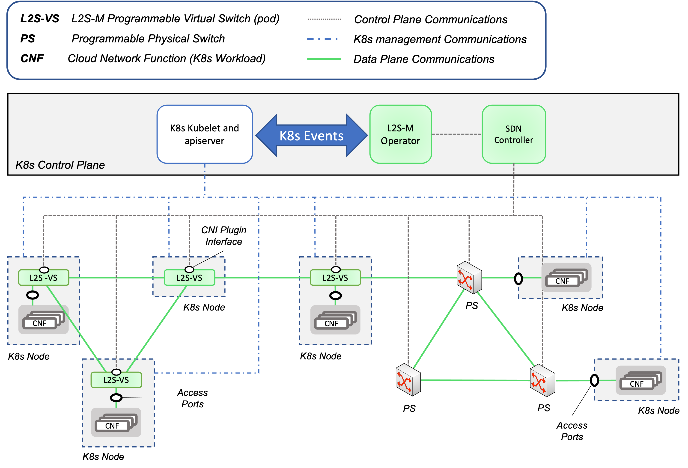

# Secure Connectivity

Welcome to the official repository of Secure Connectivity, a **NetMA** component that enables the creation of secure link-layer virtual networks in K8s clusters. This component is based on the L2S-M (Link-Layer Secure connectivity for Microservice platforms).

> **NOTE**:
>  Please, for further information about L2S-M visit its official repository: http://l2sm.io

L2S-M provides its intended functionalities using a programmable data-plane based on Software Defined Networking (SDN), which in turn provides a high degree of flexibility to dynamically incorporate new application and/or network configurations into K8s clusters. Moreover, L2S-M has been designed to flexibly accommodate various deployment options, ranging from small K8s clusters to those with a high number of distributed nodes. 

The main K8s interface of pods remains intact (provided by a CNI plugin such as Flannel), retaining the compatibility with all the standard K8s elements (_e.g._, services, connectivity through the main interface, etc.). Moreover, the solution has the potential to be used for inter-cluster communications to support scenarios where network functions are spread through multiple distributed infrastructures (this is still a work in progress).  

The figure above outlines the design of L2S-M. See [how L2S-M works](./additional-info/how-l2sm-works.mds) to find further details on the L2S-M solution.

If you want to learn how to install L2S-M in your cluster, see the [installation guide](./deployments/) of its repository to start with its installation.

Did you already install the operator and  you can not wait to start building your own virtual networks in your K8s cluster? Check out our [ping-pong](./examples/ping-pong/) example!
