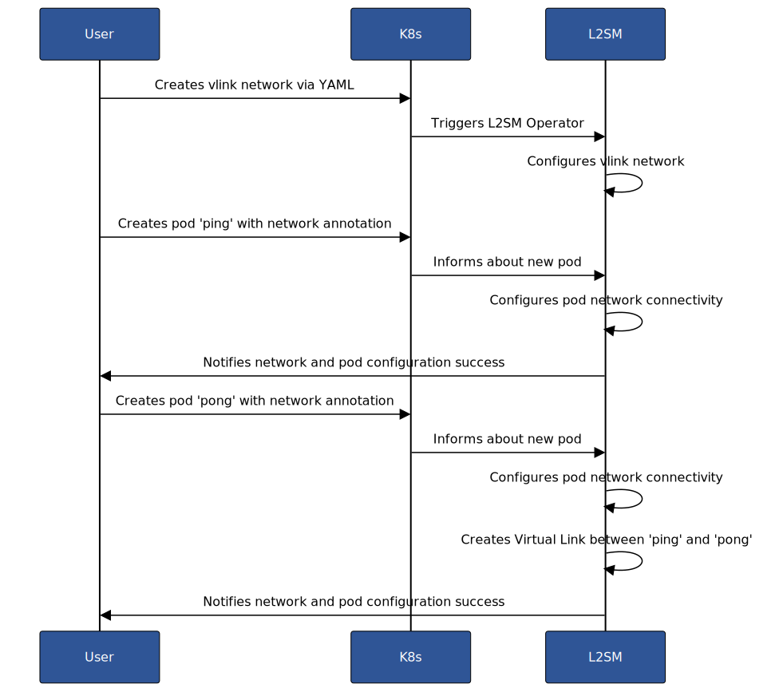

# L2S-M Vlink Network

## Introduction
This Markdown document provides an overview and documentation for the configuration of a virtual link (vlink) using the L2S-M (Link-Layer Secure connectivity for Microservice platforms) component of the NetMA.

Additionally, an example network topology of a five nodes Cluster with L2S-M installed is presented. This example will be used to discuss an example of a vlink L2S-M network followed by a YAML definition of the NetworkTopology CRD, illustrating the practical application of the configuration and interoperability with the SWM component. 

## Table of Contents
- [Vlink L2S-M Configuration](#vlink-l2s-m-configuration)
  - [Overview](#overview)
  - [Sample File](#sample-file)
  - [Fields](#fields)
- [Example](#example)
  - [Vlink Sample Path](#vlink-sample-path)
  - [Network Topology](#network-topology)

## Vlink L2S-M Configuration

### Overview
L2S-M networks are implemented using the multus CRD, NetworkAttachmentDefinition. The main component of L2S-M, the L2S-M operator will manage this resource and will configure the network to reach a desired behavior.

The sample file below shows how the Vlink network is defined, in the context of the CODECO project.

The fields represent how this network is going to be implemented. The cni type is l2sm, so the operator knows which Net-Attacht-Definition corresponds to L2S-M and should be handled. This specific L2S-M network is type 'vlink'. This means it's a point-to-point virtual link between two pods in the Cluster, where it's specified which Nodes should the communication pass through. This is further explained in the 'fields' subsection.

### Sample file

A L2S-M vlink should be specified according to the followibng YAML description:

```yaml
apiVersion: "k8s.cni.cncf.io/v1"
kind: NetworkAttachmentDefinition
metadata:
  name: <name>
spec:
  config: '{
  "cniVersion": "0.3.0",
  "type": "l2sm",
  "device": "l2sm-vNet",
  "kind": {
    "vlink": {
      "overlay-parameters": {
        "overlay-paths": {
          "direct-path": {
            "name": "<pathName1>",
            "FromEndpoint": "<endpointNodeA>",
            "ToEndpoint": "<endpointNodeB>",
            "links": ["linkA1","linkA2",...,"linkAN"],
            "capabilities": {
              "bandwidthBits": "<bps>",
              "latencyNanos": "<ns>"
            }
          },
          "reverse-path": {
            "name": "<pathName2>",
            "fromEndpoint": "<endpointNodeB>",
            "toEndpoint": "<endpointNodeA>",
            "links": ["linkB1","linkB2",...,"linkBN"]
          }
        }
      }
    }
  }
}'

```


### Fields

The config field is a JSON string with the following fields defined:


- `cniVersion` (string,required): "0.3.0". Current CNI plugin version.
- `type`(string,required): "l2sm". CNI type, l2sm represents an l2sm network.
- `kind`(dictionary, required): type of network. In this case, vlink, a point to point network between two pods.
- `vlink`(dictionary, required): specification of the kind field, as a vlink, has parameters that will specify the path the network should use.
- `overlay-parameters`(dictionary, required): parameters of this vlink network.
- `overlay-path`(dictionary,required): path configured for this vlink
- `direct-path`(dictionary,required): First path configured in this vlink. It's expected that at least this field is provided. 
- `reverse-path`(dictionary,optional): Second path configured in this vlink. If not specified, the vlink will be unidirectional.
- `name`(string,required): Name of the path.
- `FromEndpoint`(string,required): Source endpoint for the path.
- `ToEndpoint`(string,required): Destination endpoint for the path.
- `links`(list,required): List of links contained in the specified path. Should contain the name of each link from one endpoint to the other.
- `capabilities` (dictionary,optional): overlay path performance metric capabilities, there are two, the bandwidth in bits per second and the latency in nanoseconds. If not defined, the path will be set to "best-effort" by default.

In the context of the CODECO project, a vlink would be mapped to a pair of channels (channel resource type in the SWM project):

| Project NetMA Concept | Project SWM Concept   |
|-----------------------|-----------------------|
| vlink                 | One or two channels   |
| links (IP tunnels)    | NetworkLinks          |


The identifiers for the endpoints and network nodes that are needed to create a vlink will be provided to the SWM using the NetworkTopology CRD.

## Ping-pong Example

To further understand the creation of a vlink network, the following example is presented. A topology of five nodes is presented, connected through IP Tunnels with L2S-M. Two pods are deployeed, in different Computing Nodes, one is 'ping' and the other 'pong'. In this example, these pods will be connected using a vlink.


### Network Topology

The topology that's going to be used could be defined using the NetworkTopology CRD, using the link performance metrics of L2S-M. 

```yaml
apiVersion: qos-scheduler.siemens.com/v1alpha1
kind: NetworkTopology
metadata:
  name: l2sm-sample-cluster
spec:
  networkImplementation: l2sm-network
  physicalBase: logical-network
  nodes:
    - name: node-a
      type: COMPUTE
    - name: node-b
      type: COMPUTE
    - name: node-c
      type: COMPUTE
    - name: node-d
      type: COMPUTE
    - name: node-e
      type: COMPUTE
  links:
    - name: link-ab
      source: node-a
      target: node-b
      capabilities:
        bandWidthBits: "1G"
        latencyNanos: "2e6"
    - name: link-ac
      source: node-a
      target: node-c
      capabilities:
        bandWidthBits: "500M"
        latencyNanos: "3e6"
    - name: link-ba
      source: node-b
      target: node-a
      capabilities:
        bandWidthBits: "1G"
        latencyNanos: "2e6"
    - name: link-bc
      source: node-b
      target: node-c
      capabilities:
        bandWidthBits: "2G"
        latencyNanos: "1e6"
    - name: link-bd
      source: node-b
      target: node-d
      capabilities:
        bandWidthBits: "1.5G"
        latencyNanos: "2.5e6"
    - name: link-ca
      source: node-c
      target: node-a
      capabilities:
        bandWidthBits: "500M"
        latencyNanos: "3e6"
    - name: link-cb
      source: node-c
      target: node-b
      capabilities:
        bandWidthBits: "2G"
        latencyNanos: "1e6"
    - name: link-cd
      source: node-c
      target: node-d
      capabilities:
        bandWidthBits: "1G"
        latencyNanos: "2e6"
    - name: link-db
      source: node-d
      target: node-b
      capabilities:
        bandWidthBits: "1G"
        latencyNanos: "2e6"
    - name: link-dc
      source: node-d
      target: node-c
      capabilities:
        bandWidthBits: "1G"
        latencyNanos: "2e6"
    - name: link-de
      source: node-d
      target: node-e
      capabilities:
        bandWidthBits: "2G"
        latencyNanos: "2.5e6"
    - name: link-ed
      source: node-e
      target: node-d
      capabilities:
        bandWidthBits: "2G"
        latencyNanos: "2.5e6"
```

This topology represents the following scenario:

<p align="center">
  
</p>


In this figure it's presented a cluster with 5 nodes, node-a, node-b, node-c, node-d and node-e, that are connected as shown in the image. The L2S-M switches apply rules that are instructed by the L2S-M Controller, following the SDN approach. 

In this example, there is a pod in node-a, 'ping' and another one in node-e, 'pong' that are going to be connected using an L2S-M network, of type vlink.

The L2S-M Components in the L2S-M installation are as follows:

- **L2S-M Operator**: A Kubernetes operator that listens for Kubernetes events and manages network configurations programmatically. It interacts with the L2S-M Controller and uses a database to store network configurations and state.
- **L2S-M Controller**: An SDN controller based on ONOS, leveraging OpenFlow 1.3 to communicate with L2S-M Switches and manage network flows.
- **L2S-M Switch**: Pods that facilitate traffic flows as per the L2S-M Controller's instructions, ensuring isolated and direct connectivity between specific pods. There's a switch per computing Node, and they're connected through IP tunnels.

### Step by step vlink usage

The steps involving the creation of a vlink and connecting two pods through it goes as follows:

<p align="center" >
  
</p>

#### 1. Creating a Vlink

The first step involves creating a `vlink` network, named "vlink-sample", using the NetworkAttachmentDefinition CRD from Multus. This network facilitates direct, isolated communication between pods across different nodes, through custom paths. 

The defined path is selected as an example, but in a real case scenario it may be another one.


```yaml
apiVersion: "k8s.cni.cncf.io/v1"
kind: NetworkAttachmentDefinition
metadata:
  name: vlink-sample
spec:
  config: '{
  "cniVersion": "0.3.0",
  "type": "l2sm",
  "device": "l2sm-vNet",
  "kind": {
    "vlink": {
      "overlay-parameters": {
        "path": {
          "name": "first-path",
          "FromEndpoint": "node-a",
          "ToEndpoint": "node-e",
          "links": ["link-ac","link-cd","link-de"],
          "capabilities": {
            "bandwidthBits": "20M",
            "latencyNanos": "8e5"
          }
        },
        "reverse-path": {
          "name": "second-path",
          "fromEndpoint": "node-e",
          "toEndpoint": "node-a",
          "links": ["link-ed","link-db","link-ba"]
        }
      }
    }
  }
}'


```


The creation of a vlink network begins with deploying the 'vlink-sample' YAML configuration, which outlines the specifications for the desired network. Following this deployment, the L2SM operator is activated, recognizing the new network configuration and subsequently initiating contact with the L2SM controller. This step involves the operator saving the network path information for future reference. 

The L2SM controller, upon being informed of the new network, holds off on initiating any traffic flow immediately, opting instead to wait until pods are connected to the network, ensuring a streamlined process for establishing network connectivity.

#### 2. Deploying Pods with Network Annotations

Deployment involves creating pods with specific annotations to connect them to the `vlink-sample` network. This section explains how pod 'ping' in node-a and pod 'pong' in node-e are deployed and managed within the network.

##### A. Deploying pod 'ping'

```yaml
apiVersion: v1
kind: Pod
metadata:
  name: ping
  labels:
    app: ping-pong
  annotations:
    k8s.v1.cni.cncf.io/networks:  '[
            { "name": "vlink-sample",
              "ips": ["192.168.1.2/24"]
            }]'
spec:
  containers:
  - name: router
    command: ["/bin/ash", "-c", "trap : TERM INT; sleep infinity & wait"]
    image: alpine:latest
    securityContext:
      capabilities:
        add: ["NET_ADMIN"]
    nodeName: node-a
```

- **Pod Configuration**: Pod 'ping' is defined with the `vlink-sample` annotation and an "ips" argument specifying its IP address.
- **Connection to L2SM-Switch**: Pod 'ping' is attached via Multus to an L2S.M component known as the l2sm-switch, controlled by the L2S-M controller. This grants 'ping' two network interfaces: the default (provided by Flannel or Calico) and the new vlink interface.


##### B. Deploying pod 'pong'

```yaml
apiVersion: v1
kind: Pod
metadata:
  name: pong
  labels:
    app: ping-pong
  annotations:
    k8s.v1.cni.cncf.io/networks:  '[
            { "name": "vlink-sample",
              "ips": ["192.168.1.3/24"]
            }]'
spec:
  containers:
  - name: router
    command: ["/bin/ash", "-c", "trap : TERM INT; sleep infinity & wait"]
    image: alpine:latest
    securityContext:
      capabilities:
        add: ["NET_ADMIN"]
    nodeName: node-e
```

- **Node Placement**: Pod 'pong' is created on NodeE with the `vlink-sample` network annotation but uses a different IP address than pod 'ping'.
- **Network Connectivity**: The L2SM controller then establishes the necessary intents and flows, ensuring traffic between 'ping' and 'pong' traverses the predefined nodes. This setup guarantees direct, isolated connectivity between the two pods.

