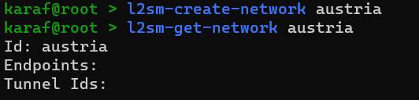
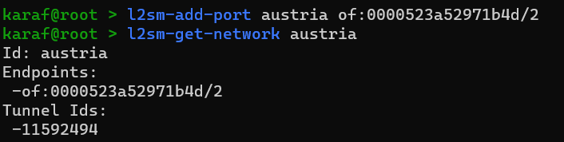
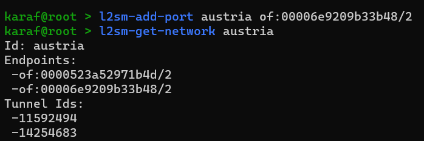

# IDCO
ONOS-based SDN solution built from the original IDCO code.

## Installation

### Deploying the IDCO
This application requires the following applications to be activated in ONOS:
- org.onosproject.drivers
- org.onosproject.lldpprovider
- org.onosproject.openflow-base
- org.onosproject.optical-model

Activating other applications could negatively affect the correct functioning of this application.

Get an ONOS v2.7.x instance and install the oar (idco-app-1.0.oar in this repository).

To install an oar file in ONOS, follow the official documentation. The easiest way is to login through the web GUI, go to applications, and upload the file. 

### Connecting the L2S-M switches
The switches must be connected to the IDCO throught the OpenFlow 1.3 protocol. There is no specific requirement for the port names. The VXLAN tunnels must be created inside the OvSs with the options:key=flow option set (see example in https://docs.openvswitch.org/en/latest/faq/vxlan/).

## Usage
This application currently provides 3 commands: l2sm-create-network, l2sm-add-port, l2sm-get-network and l2sm-delete-network. This commands must be executed in the ONOS karaf CLI.

#### Example of how it could be used with L2S-M
L2SM notices a new network has been created called "austria" (new network attachment definition). Subsequently, it sends the create command to the IDCO. A new network with 0 points will be created:

When a new VNF joins the "austria" network, the L2S-M connects it to the L2S-M switch through a veth pair. At that point, the L2S-M should have a way to know the name of the port of the switch the veth has been connected to (name = openflow switch id + openflow port number). After getting this information, it can send an add-port command to the IDCO to add that port to the network:

When other VNFs join the network, the same command must be used to add them to the network:

Every time a new port is added to a network, the IDCO will make sure the needed flow rules are installed in the switches to connect those ports (in the images below, it is shown how the IDCO assigns a random VNI to each port that is used to forward traffics from and to it). These rules are the same as those used in the original IDCO, meaning:

- Virtual link PtP tunnels for 2-point networks
- Virtual network source-based trees for multi-point networks
- The ports of the network can be either in the same or in different networks. It works the same

#### Interface between the L2S-M and the IDCO
How does L2S-M send commands to the IDCO? It could easily be done through the HTTP REST API. The code for it is not visible in this repository but could be easily added (it is pretty similar to the code in the original IDCO). This way, the L2S-M could execute the l2sm-create-network, l2sm-add-port, l2sm-get-network and l2sm-delete-network commands by sending small JSON files with the parameters to the IDCO through HTTP.

## Manual compilation (Optional)
To compile, execute in this directory:

`mvn clean install`

The compiled oar will be then found in the target/ directory.

WARNING: The build process has only been tested with the java-1.11.0-openjdk-amd64 JDK version.
